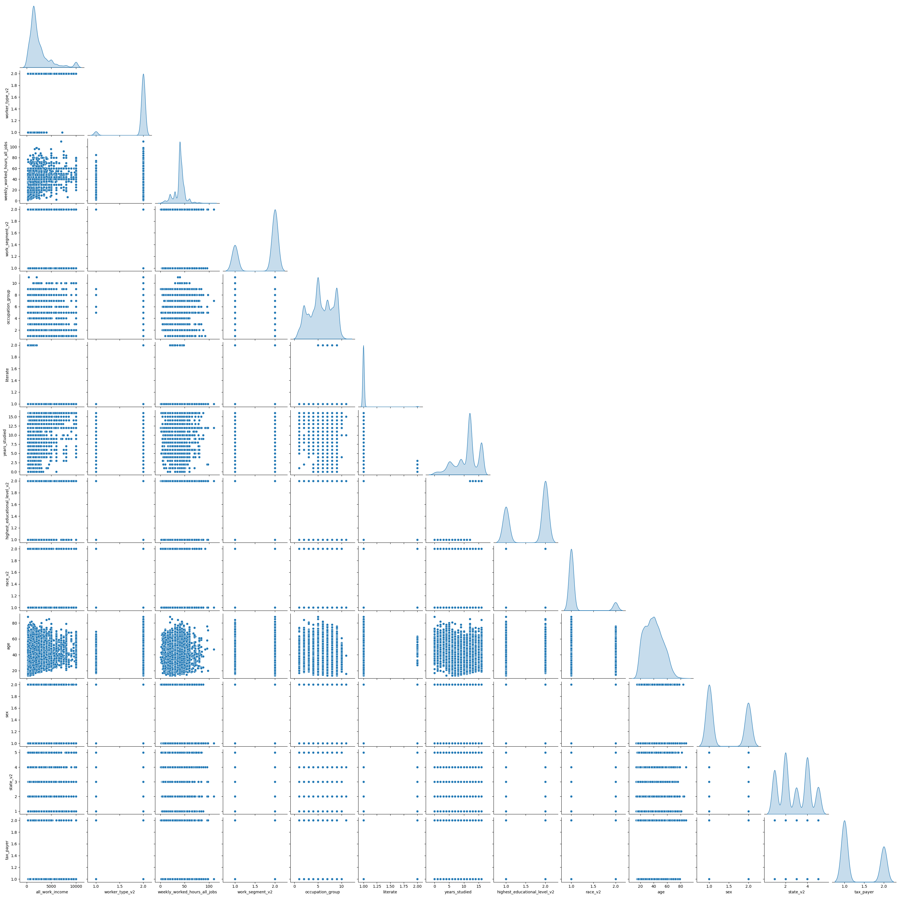

# Income Prediction Based on Sociodemographic Variables

## Objective

This project aims to develop a machine learning model to estimate the income of individuals based on sociodemographic and occupational variables, using microdata from the National Household Sample Survey (PNAD) collected by the Brazilian Institute of Geography and Statistics (IBGE).

## Problem and Relevance

Accurate income prediction is essential for:

- **Market Segmentation:** Enhancing targeted marketing and increasing ROI.
- **Credit Policies:** Reducing default rates and improving credit portfolio profitability
- **Product Personalization:** Tailoring offers to consumer purchasing power, boosting customer satisfaction.

## Project Structure

1. **Data Collection**
   - **Initial Selection:** Chose relavant columns based on domain knowledge, intuition and the available data dictionaries. 
   - **Data Retrieval:** Used SQL through Python to request data from Base dos Dados public Data Lake on BigQuery.
   - **Results:** Collected 794,507 rows and 15 columns, saving in a compressed CSV file 
   - **Performance**: Query completed in approximately 2 minutes

2. **Exploratory Data Analysis**
   - **Data Cleaning**: 
      - Identified and removed outliers across the entire using unsupervised learning (Isolation Tree Method).
   - **Univariate Analysis**: 
      - Analyzed income to understand its distribution and key statistics.
      - Found that nearly 100% of respondents earned up to R$ 10,000 per month.
      
   - **Bivariate Analysis**: 
      - Explored relationships between pairs of variables using scatterplots, strip plots, and heatmaps.
      - Applied mutual information and hypothesis testing to assess the strength of associations.
      
   - **Multivariate Analysis**: 
      - Examined interactions among multiple variables using pairplots.
      - Focused on key segments to identify patterns and correlations.
      
   - **Feature Engineering**: 
      - Developed new features to capture hidden relationships within the data.
      - Example: Created a feature to discretize studied years.
      

3. **Model Production**
   - **Pre-processing:** Created a Sklearn Pipeline that created new features and performed target encoding avoiding data leakage.
   - **Model Selection:** Utilized Random Forest (Bagging), LGBM (Boosting), and a combination of both to attempt to predict income with a R$ 500 MAE. 
   - **Model Evaluation:** Employed cross_validation, data visualization, hypothesis testing, and a combination of metrics to assess model performance.
   

5. **API Development**
   - (...)

6. **API Testing and Validation**
   - (...)

## Technologies Used

- **Programming Language:** Python (3.9.19)
- **Data Science Libraries:** Pandas, NumPy, Scikit-learn, Matplotlib, Seaborn
- **API Framework:** (...)
- **Deployment Platforms:** (...)

## Installation

To install the necessary dependencies, run the following command:
```sh
pip install -r requirements.txt
```

## Contribution
Feel free to contribute with suggestions, improvements, or corrections. To contribute:

1. Fork this repository.
2. Create a branch with your feature (git checkout -b feature/new-feature).
3. Commit your changes (git commit -m 'Add new feature').
4. Push to the branch (git push origin feature/new-feature).
5. Open a Pull Request.

## License
This project is licensed under the MIT License - see the LICENSE file for details.

## Contact
For more information, contact me at [my email](mailto:v.suares.s@hotmail.com).